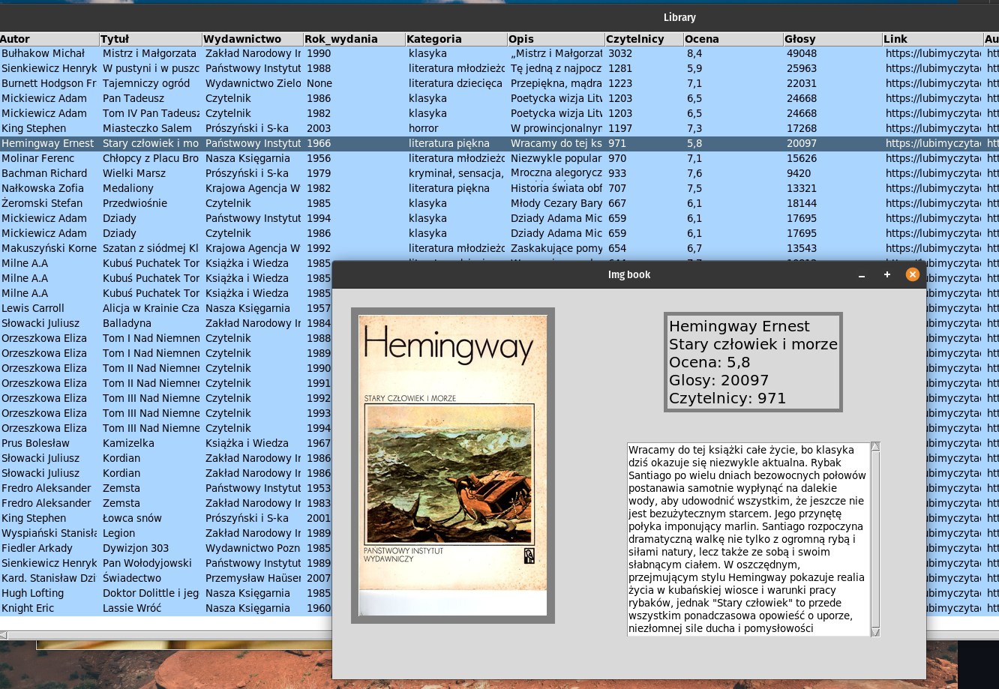

# Bookstore
> Program in python for easy viewing of your favorite books from your home library loaded by Autor,Tytuł,Wydawnictwo,Rok wydania from xlsx file 
> stored sql database
> with options for geting informations from website like www.lubimyczytac.pl and also books covers downloaded from google image

## Table of Contents
* [General Info](#general-information)
* [Technologies Used](#technologies-used)
* [Features](#features)
* [Screenshots](#screenshots)
* [Setup](#setup)
* [Usage](#usage)
* [Additional info](#additional-info)
* [Disclaimer](#Disclaimer)

<!-- * [License](#license) -->

## General Information
- Program use beautifulsoup4 for scrape info from others website for descriptions, ratings and readers
- Find your book covers using google_images_download by author title publisher, date release - it's very easy to locate it now
- Check out book genres and desciptions, sort by any column you choose

<!-- You don't have to answer all the questions - just the ones relevant to your project. -->

## Technologies Used
- beautifulsoup4==4.11.2
- fake_useragent==1.1.1
- pandas==1.4.3
- Pillow==9.4.0
- requests==2.25.1
- google_images_download

## Features
- Adding books with Autor,Tytuł,Wydawnictwo,Rok wydania from xlsx file
- Adding rating description and readers
- Adding covers
- Browse books

## Screenshots

## Usage
run program by 
`python tkinter_books_menu.py`

## Additional info
- google-images-download now is only working from this repository, as main resorce seems still not updated
	https://github.com/d0codesoft/google-images-download
- for polish covers change utf-8 to latin-1

## Disclaimer
- I take no responsibility for what others do with that code, I do not advise for scraping websites that do not explicitly allow it, App is posted as a learning exercise and demonstration of programming skills in python

<!-- Optional -->
<!-- ## License -->
<!-- This project is open source and available under the [... License](). -->

<!-- You don't have to include all sections - just the one's relevant to your project -->
